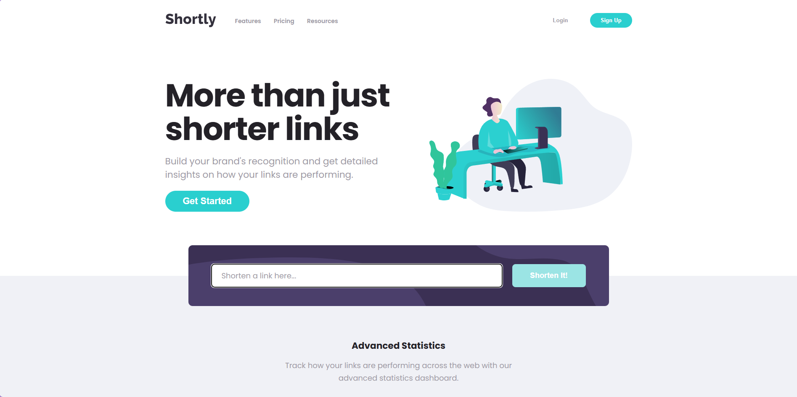

#

A responsive URL-shortening landing page built from the Frontend Mentor Shortly design. The application integrates with the Bitly API, validates user input, renders shortened links dynamically, copies links to the clipboard, and preserves results between browser sessions with local storage.

## Screenshots

### Desktop

### Validation Error

[!Shortly custom URL validation error](./images/validation_error.png)

### Mobile

[!Shortly mobile layout](./images/mobile.png)

### Mobile Navigation

[!Shortly mobile navigation](./images/mobile_navigation.png)

## Live Demo

### Live application: 

### GitHub repository: github.com/pleonard02/url-shortening-api-master

## Table of Contents 

- Overview
- Features
- Built With
- Project Architecture
- Getting Started
- Environment Variables
- Available Scripts
- How It Works
- Validation and Error Handling
- Accessibility
- Responsive Design
- Testing Checklist
- Reflection
- Future Improvements
- Acknowledgments

## Overview 

This project recreates the supplied desktop, mobile, and active-state designs for the Shortly URL-shortening challenge. Its primary goal is to provide a polished responsive interface while demonstrating TypeScript, asynchronous programming, API integration, custom error handling, DOM manipulation, browser storage, and modular application architecture.

Users can enter a complete URL, request a shortened Bitly link, copy the result, and return to their previously generated links after refreshing the browser.

## Features

  - Shortens valid URLs through the Bitly v4 API 
  - Validates empty and malformed URL input before making an API request
  - Displays custom, accessible error messages
  - Dynamically renders the original and shortened URLs
  - Copies a shortened URL to the clipboard with one click
  - Provides temporary visual feedback after a successful copy
  - Preserves shortened links with localStorage
  - Restores saved links when the page reloads
  - Prevents malformed stored data from breaking the interface
  - Includes responsive desktop and mobile layouts
  - Includes an accessible mobile navigation menu
  - Supports form submission by button click or Enter key
  - Provides hover, focus, active, copied, and error states for interactive elements

## Built With

  - Semantic HTML5
  - CSS3
    - Flexbox
    - CSS Grid
    - Custom properties
    - Responsive media queries
  - TypeScript
  - Vite
  - Bitly v4 API
  - Fetch API
  - Clipboard API
  - Web Storage API (localStorage)
  - Git and GitHub

## Project Architecture

The TypeScript is separated by responsibility so that API communication, data models, rendering, storage, validation, and application coordination are not combined in one large file.

src/
|-- main.ts
|-- models/
|   `-- ShortenedLinks.ts
|-- services/
|   `-- BitlyClient.ts
|-- ui/
|   `-- renderLink.ts
`-- utils/
    |-- errorHandler.ts
    `-- storage.ts

## Project Architecture

The TypeScript is separated by responsibility so that API communication, data models, rendering, storage, validation, and application coordination are not combined in one large file.

| File | Responsibility |
| --- | --- |
| `main.ts` | Selects DOM elements, coordinates events, validates submissions, calls the API client, renders results, and updates storage. |
| `models/ShortenedLinks.ts` | Defines the `ShortenedLink` TypeScript interface used across the application. |
| `services/BitlyClient.ts` | Encapsulates Bitly authentication and the asynchronous shortening request. |
| `ui/renderLink.ts` | Creates result markup, configures safe external links, and handles clipboard interaction. |
| `utils/errorHandler.ts` | Contains validation logic, reusable error messages, custom error classes, and input-error helpers. |
| `utils/storage.ts` | Loads and saves links and validates unknown data retrieved from local storage. |

## Getting Started

### Prerequisites

  - Node.js and npm
  - A Bitly account and access token

## Installation

  1. Clone the repository:
    git clone https://github.com/pleonard02/url-shortening-api-master.git
  2. Enter the project directory: 
    cd url-shortening-api-master
  3. Install the dependencies:
    npm install
  4. Create a .env file in the project root:
    VITE_BITLY_TOKEN=your_bitly_access_token
  5. Start the development server: 
    npm run dev
  6. Open the local URL printed by Vite in a browser.

## Environment Variables

| Variable | Purpose |
| --- | --- |
| `VITE_BITLY_TOKEN` | Authorizes requests to the Bitly URL-shortening endpoint. |

The .env file is excluded from version control and must not be committed.

  Security note: Vite exposes variables prefixed with VITE_ to client-side code. This project follows the coursework requirement for direct API integration and should be treated as an educational prototype. A production implementation should send Bitly requests through a protected backend or serverless function so the access token is never included in browser-delivered JavaScript.

## Available Scripts

| Command | Description |
| --- | --- |
| `npm run dev` | Starts the Vite development server. |
| `npm run build` | Runs the TypeScript compiler and creates the production build. |
| `npm run preview` | Serves the production build locally for final verification. |

## How It Works

  1. The application loads saved results from localStorage.
  2. Each valid saved object is rendered into the shortened-links container.
  3. The user submits a URL through the shortening form.
  4. validateUrl() trims and validates the input before any network request is made.
  5. BitlyClient.shorten() sends an asynchronous POST request to Bitly.
  6. An unsuccessful response produces a typed ApiError containing the HTTP status.
  7. A successful response is rendered immediately and saved locally.
  8. The Copy button writes the short URL to the clipboard and provides temporary confirmation.

## Validation and Error Handling

The application distinguishes between user-input errors, API errors, and unexpected failures.

  - Empty input produces a clear request to add a link.
  - Invalid input asks for a complete URL, including the protocol.
  - HTTP failures are converted into a custom ApiError.
  - Network or unexpected errors are caught so they do not produce an unhandled rejection.
  - Invalid or corrupted local-storage values are discarded safely through a TypeScript type guard.
  - Error styling and aria-invalid are removed when the user begins correcting the input.

Validation occurs before the Bitly request, avoiding unnecessary API usage.

## Accessibility 

  - The document declares its language and uses semantic page landmarks.
  - The URL controls are grouped in a semantic form.
  - The URL field has an accessible name and identifies its associated error message.
  - The error region uses aria-live="polite" so validation feedback can be announced.
  - Invalid input is identified with aria-invalid.
  - The form supports keyboard submission with Enter.
  - Buttons use native button elements and visible focus states.
  - The mobile menu communicates its state through aria-expanded and aria-controls.
  - The mobile menu can be dismissed with the Escape key.
  - External shortened links open safely with noopener noreferrer.
  - Meaningful images include alternative text, while navigation remains keyboard accessible.

## Responsive Design

The interface follows the supplied desktop and mobile compositions while allowing content to adapt between those endpoints.

  - Shared maximum content widths keep desktop sections aligned.
  - CSS Grid creates the desktop hero, statistics cards, results, and footer layouts.
  - Flexbox manages navigation and form controls.
  - Mobile media queries reorder the hero, stack form controls and results, convert the statistics connector from horizontal to vertical, and transform the desktop navigation into an expandable menu.
  - Long URLs use overflow handling so they do not break the layout.
  - Desktop and mobile background assets are selected at the appropriate breakpoint.

## Testing Checklist

The application was manually verified for the following behavior:

  - [x] Empty submissions display the custom required-field error
  - [x] Invalid URLs display the custom format error
  - [x] Valid URLs are shortened and displayed dynamically
  - [x] Validation failures do not make Bitly requests
  - [x] Copy writes the shortened URL to the clipboard
  - [x] Saved links return after a page refresh
  - [x] The form can be submitted with Enter
  - [x] The mobile menu opens and closes
  - [x] The mobile menu closes with Escape
  - [x] The layout adapts across mobile and desktop widths
  - [x] `npm run build` completes without TypeScript errors
  - [ ] Live deployment has been tested

## Reflection

### Challenges

The most demanding part of this project was coordinating the responsive layout across the supplied desktop and mobile designs. Several elements intentionally cross section boundaries, including the shortening form, while the statistics cards use different vertical offsets on desktop and a single connected column on mobile. Long dynamic URLs introduced another layout constraint because their length cannot be predicted from the static design.

The project also required careful management of the Bitly API request limit. I needed to ensure that empty and malformed values were rejected before fetch() ran and that the interface did not encourage duplicate submissions. Testing validation separately from live API behavior allowed me to debug without wasting requests.

Another challenge was reorganizing an accidentally nested Vite project. Git initially reported deleted files at the old location and untracked files at the corrected location. Reviewing the staged changes showed that Git recognized most of the cleanup as file renames, which allowed me to preserve the work and maintain a clear project structure.

### Solutions and Learning

I separated the application into focused modules instead of leaving all behavior in main.ts. The BitlyClient class now owns the endpoint, authorization, and request behavior. Reusable validation and custom errors live in errorHandler.ts; storage logic lives in storage.ts; and DOM construction and clipboard behavior live in renderLink.ts. The ShortenedLink interface gives those modules a shared contract.

This structure helped me understand how asynchronous operations move through an application: a form event triggers validation, validation protects the API call, the API client returns a typed Promise, the result is rendered, and the updated collection is persisted. It also reinforced that TypeScript assertions do not validate runtime data, which is why stored values are checked with a type guard before being used.

For accessibility, I changed the URL controls to a semantic form without altering the supplied visual design. This added Enter-key submission while preserving the same button and CSS class. I also connected the input to its live error message and implemented state attributes for the mobile navigation.

### What I Would Improve

For a production release, my first improvement would be moving the Bitly request into a backend or serverless function so the access token is never exposed to the browser. I would also add automated unit tests for URL validation and storage parsing, integration tests for rendering and form behavior, and end-to-end tests for keyboard navigation and responsive menus. Additional improvements could include deleting individual saved results, limiting storage history, and communicating rate-limit status more clearly.

## Future Improvements

  - Move Bitly authentication behind a backend or serverless proxy
  - Add unit, integration, accessibility, and end-to-end tests
  - Allow users to remove individual saved links or clear their history
  - Prevent duplicate URLs from appearing repeatedly
  - Add explicit rate-limit feedback
  - Add non-color status messaging for clipboard failures
  - Evaluate stored-data versioning if the result model expands

## Acknowledgments

  - Challenge and design assets provided by Frontend Mentor
  - URL-shortening service provided by Bitly
  - Typography provided through Google Fonts

## Author

### Priscilla Leonard

  - GitHub: @pleonard02